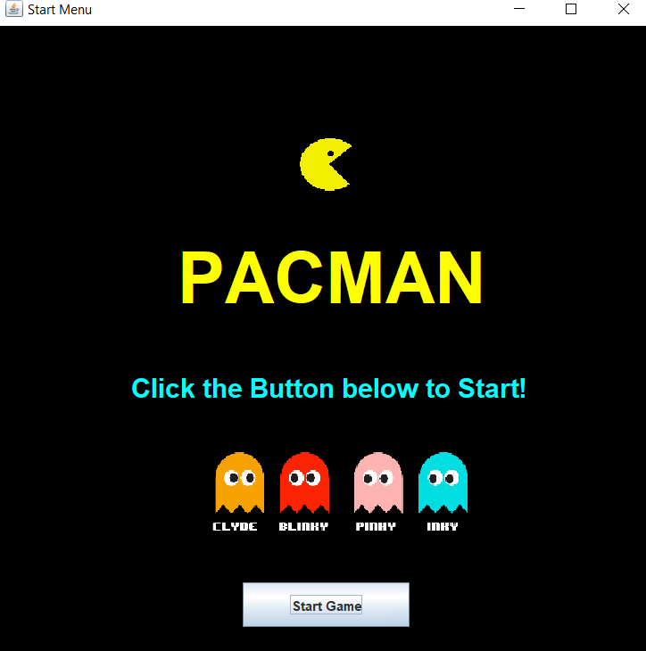
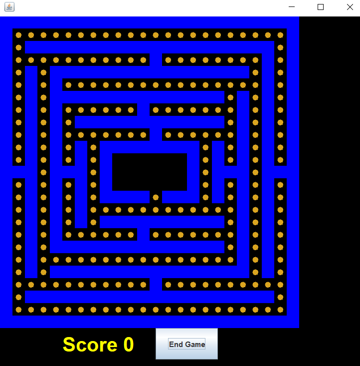

# CMSC389T: Project Pacman
# Group Members: Brayden Ngo, Rohit Sengupta, Nevil Patel

# How to Run Code
* Run gradle build --> makes sure that the code compiles
* Run gradle run --> runs the game. Popup should appear that allows you to start the game

# Methods
* Pacman-get_valid_moves Implementation --> Assign iMax and jMax to current location + 2 (effectively goes to max +1 of Pacman's
  current value). If statement checks if the current location on the map is a Wall. If it is not a wall, we can go ahead and add
  the location to the result.

* Pacman-get_valid_moves Test --> Calls get_valid_moves and compares the arraylist result returned to the expected result

* Ghost-move Implementation --> Uses Java Random generator to generate a random number within the size of the available moves
  for ghost arraylist. Indexes the random location picked from the location arraylist.
* Ghost-move Test --> Creates the game and calls move on ghost. Makes sure that it's false because currently ghost valid moves    isn't implemented. 

* Map-attack Implementation --> Retrieves location based on the name parameter passed into the method. Removes Pacman from the field and changes the gameOver instance variable to true
* Map-attack Test --> Calls ghost attack and checks the status of the gameOver variable

* Pacman-is_ghost_in_range Implementation--> uses two for loops to iterate through the spaces directly horizontal and vertical to the current location of Pacman. If one of these spaces has Type.GHOST, true is returned.

* Pacman-is_ghost_in_range Test --> Creates a new map, and adds a ghost and pacman directly next to each other on the map. Calls is_ghost_in_range on the pacman and returns the output

* Map-eatCookie Implementation --> Checks to see if the current location of packman also contains a cookie. If so, the cookie will be deleted from field, and the CookieComponent is returned

* Map-eatCookie Test --> Creates a new map, and adds a cookie and pacman in the same location on the map. Calls eatCookie on the map and returns the output

* Ghost-attack Implementation --> uses two for loops to iterate through the spaces directly horizontal and vertical to the current location. If one of these spaces has Type.PACMAN, true is returned.

* Ghost-attack Test --> Creates a new map, and adds a ghost and pacman directly next to each other on the map. Calls attack on the Ghost and returns the output
